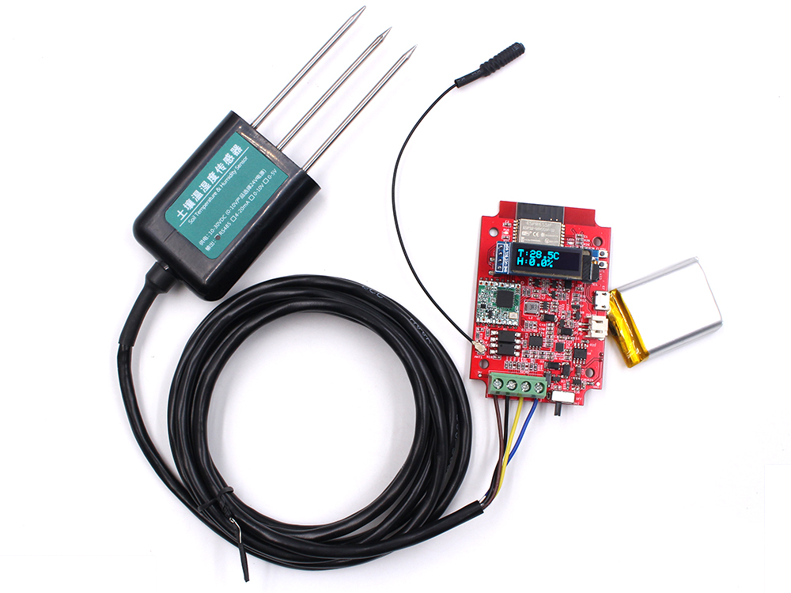

# Industrial-grade Soil Remote Monitor

```c++
/*
Version:		V2.0
Author:			Vincent
Create Date:	2023/3/1
Note:
		2023/3/1	V2.0: Use new sensor, change request code.
*/
```




[toc]

# Makerfabs

[Makerfabs home page](https://www.makerfabs.com/)

[Makerfabs Wiki](https://wiki.makerfabs.com/)

# Industrial-grade Soil Remote Monitor

## Intruduce

Product Link ：[Industrial-grade Soil Remote Monitor(Humidity/ Temperature/ PH/ Nitrogen/ Phosphorus/ Potassium)](https://www.makerfabs.com/industrial-grade-soil-remote-monitor.html) 

Wiki Link : [RS485-LoRa Wireless Station](https://www.makerfabs.com/wiki/index.php?title=RS485-LoRa_Wireless_Station) 

With the development of agricultural modernization and the popularization of precision agriculture, the remote monitoring of soil parameters such as temperature, moisture, PH, and so on, becomes more important.

This Industry-grade soil remote monitor intends for these applications of agriculture, it is mainly composed of 2 parts:

**1. Remote monitor station with RS485:** developed by Makerfabs, it converts the RS485 signal, which is usually used in agricultural field applications, to wireless connections WIFI (if there is) or Lora, or Bluetooth.
**2. Industrial-grade Soil Sensor:** unlike some other maker-level soil sensors that only output analog voltage that reflects the soil status/changes but not the absolute value, this sensor measures the soil parameters such Temperature/Moisture/PH/Nitrogen/ Phosphorus/Potassium.., with calculated true output, so users can get to know the real soil parameters.


## Feature

- ESP32 WROOM module onboard with the WiFi and Bluetooth
- Arduino Compatible: You can play it with Arduino IDE
- Onboard LoRa module (433Mhz or 868Mhz or 915Mhz)
- 0.91inch I2C OLED display
- Sensor part is waterproof, completely sealed
- Measuring range: -40℃~80℃，0~100% moisture
- Measuring accuracy: ±0.5℃，±3% moisture
- Communication distance: Lora: 2km or more; WIFI: No such parameter
- Power by Micro USB, battery, or DC 5V
- 1000mAh battery, charger IC onboard


# Code

## Compiler Options

**If you have any questions，such as how to install the development board, how to download the code, how to install the library. Please refer to :[Makerfabs_FAQ](https://github.com/Makerfabs/Makerfabs_FAQ)**

- Install board : ESP32 .
- Install library : Adafruit GFX library (V1.10.11) , Adafruit SSD1306 library (V2.4.6) and RadioLib library 4.0.6.
- Upload codes, select "ESP32 Dev Module"


## Sensor User Manual


Cable definition:

- Grey cable: DC 5V power supply +
- Black line: Power ground (GND)
- Yellow and green wires: RS485-A;
- Brown cable: RS485-B.


The sensor uses Modbus RTU.

Request Command：**01 04 00 00 00 07 B1 C8**

- 0x01 Sensor address; 
- 0x04 function code; 
- 0x00 0x00 read register start position; 
- 0x00 0x07 Number of registers read; 
- 0xB1 0xC8  Check


Receive Data：**01 04 0E 01 D7 01 07 00 00 00 46 00 0F 00 14 00 32 CC 93**

- 0x01 Sensor address;
- 0x04 function code;
- 0x0E data length;
- 0x01 0xD7 Soil moisture data 01 D7 (hexadecimal) is 47.1%
- 0x01 0x07 Soil Temperature Data 01 07 (hexadecimal) is 26.3 ° C
- 0x00 0x00 blank
- 0x00 0x46 PH data 00 46 (hexadecimal) is 7.0
- 0x00 0x0F Soil Nitrogen data 00 0F (hexadecimal) is 15mg/kg
- 0x00 0x14 Soil Phosphorus data 00 14 (hexadecimal) is 20mg/kg
- 0x00 0x32 Soil potassium data 00 32 (hexadecimal) is 50mg/kg
- 0xCC 0x93 check

 

| Parameter   | Address | Range       | Sampling Value | Action    |
| ----------- | ------- | ----------- | -------------- | --------- |
| Humidity    | 0000H   | 0~100%      | /10            | Only Read |
| Temperature | 0001H   | -40~80℃     | /10            | Only Read |
| PH          | 0003H   | 4~9         | /10            | Only Read |
| Nitrogen    | 0004H   | 0~1999mg/kg | /1             | Only Read |
| Phosphorus  | 0005H   | 0~1999mg/kg | /1             | Only Read |
| Potassium   | 0006H   | 0~1999mg/kg | /1             | Only Read |

